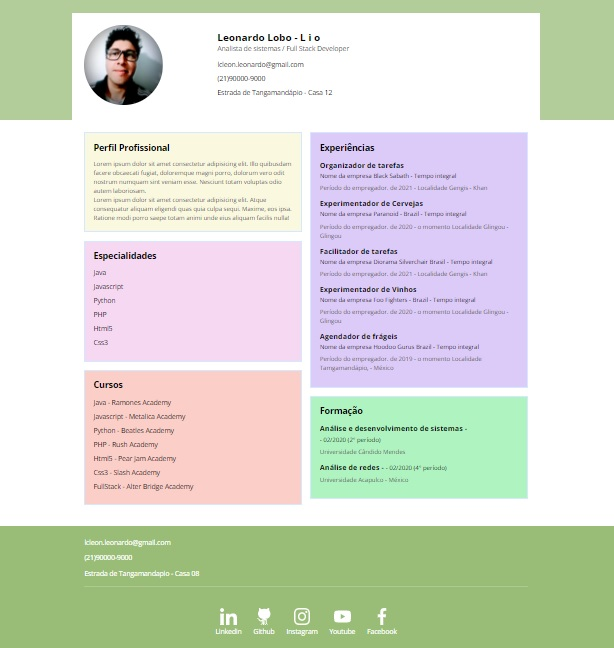

# Currículo simples com Html5 e CSS3

## Veja nesse link o pojeto
>https://lcleon.github.io/Modelo_de_curricuo_html5_css3/
---

>PT-BR
 Exemplo de currículo usando somente html5 e css3 contendo, na maior parte, informações fictícias. 

 > ENG
Sample resume using only html5 and css3 containing mostly fictitious information.
---
### Sobre o projeto
>_Basicamente o projeto mostra a utilização de grids com diferentes cores para cada área dentro do currículo além do arredontamento da imagem fornecida pelo candidato, criando um design mais bonito e atual._ 
>_Conta também com um rodapé customizado com as principais redes sociais em link direcionado para o perfil do candidato para cada uma delas._
>_O endereço também nos mostra um link, abrindo o google maps na residência do candidato assim como o numero de telefone que já abre diretamente para ligação e o email com link direto para o email de preferência._
---
### Tecnologias utilizadas

>- Html5
     - Semântica atualizada
> - CSS3 
    - Grid layout
    - Flexbox
---
### Imagem do projeto

